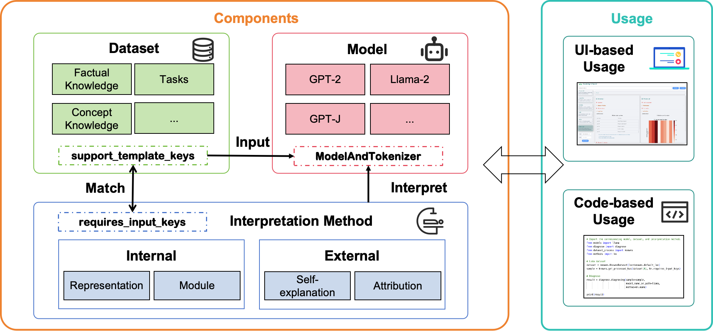

#  Know-MRI: A Knowledge Mechanisms Interpreter for Large Language Models

Know-MRI is a comprehensive toolkit for analyzing knowledge mechanisms in LLMs.

## Installation 🚀
You can create an environment and install the dependencies via [Anaconda](https://www.anaconda.com).
```shell
conda create -n Know-MRI python=3.10
conda activate Know-MRI
pip install -r requirements.txt
```

## Feature 📃

### Framework
Know-MRI primarily integrates model, dataset, and interpretation method.

<h3 align="center">

</h3>

#### Model 
* **Supported Types**: Know-MRI can apply to 10 types of models on Huggingface, including Bert, GPT2, GPT-J, T5, Mistral, Llama2, Baichuan, Qwen, ChatGLM and InternLM.


#### Dataset
* **Supported Types**: Know-MRI has integrated more than 13 datasets:
`ZsRE, PEP3k, Known-1000, 20Q, Concept edit, CounterFact, Bias neuron data, GSM8K, Meta Math, Imdb, Emotion, Opus Books and, Opus 100.`


#### Interpretation Method
* **Supported Types**: Know-MRI employs two main categories of interpretation methods: external and internal explanations

     

### Interpretation Methods and Models Supported
We integrate a variety of interpretation methods to assist users in comprehensively analyzing knowledge mechanisms of LLMs.

| Method                  | gpt2 | gptj | llama | baichuan | bert | t5 | chatglm2 | internlm | qwen |
|:-------------------------:|:------:|:------:|:-------:|:----------:|:------:|:----:|:----------:|:----------:|:------:|
|  Self-explanations        | ✓    | ✓    | ✓     | ✓        |      | ✓  | ✓        | ✓        | ✓    |
| Attribution | ✓  | ✓    | ✓     |          |      |    |          |          | ✓    |
| Embedding Projection       | ✓    | ✓    | ✓     | ✓        | ✓    | ✓  | ✓        | ✓        | ✓    |
|  Attention Weights       | ✓    | ✓    | ✓     | ✓        | ✓    | ✓  |          | ✓        |      |
| KN      | ✓    | ✓    | ✓     | ✓        | ✓    |    |✓        | ✓     | ✓    |
|  CausalTracing             | ✓    | ✓    | ✓     | ✓        |      |    | ✓        | ✓        | ✓    |
| FINE                     | ✓    | ✓    | ✓     | ✓        | ✓    | ✓  |          | ✓        | ✓    |
|  Knowledge Circuit        | ✓    | ✓    | ✓     |          |      |    |          |          |      |
|  Logit Lens              | ✓    | ✓    | ✓     | ✓        | ✓    | ✓  | ✓        | ✓        | ✓    |
|  PatchScopes              | ✓    | ✓    | ✓     | ✓        |      |    |          | ✓        | ✓    |
|  SPINE                   | ✓    | ✓    | ✓     |          | ✓    | ✓  | ✓        |          | ✓    |

## Example Usage ⚙️
To begin with, you can change the hyperparameter in `/Know-MRI/methods/XXX/hparams/xxxmodel.json`. The file name corresponds to `/Know-MRI/models/__init__.py`.

### Code-based Usage
We provide some code-based usage examples in `/Know-MRI/example`.
This example uses the KN method to analysis Llama2:
```python
# Import corresponding interpretation method, dataset and model.
from diagnose import diagnose
from dataset_process import counterfact
from methods import kn
from models import llama

# Loda dataset.
dataset = counterfact.CounterfactDataset(loc=counterfact.default_loc)
sample = counterfact.get_processed_kvs(dataset[0], kn.requires_input_keys)

# Diagnose (interpret).
result = diagnose.diagnosing(sample=sample, model_name_or_path=llama, method=kn.name)

print(result)
```

### UI-based Usage
The Know-MRI also has a UI for easy usage:

<h3 align="center">

</h3>

You can use the UI in the following way:
```shell
cd /GUI

python flask_server.py \
     --vecdb_config_path="Path of config for loading embedding model." \
    --openai_base_url \
    --openai_api_key                      
```

## For Developers 😎
We have reserved extension interfaces for developers.

#### Model 

We propose a standardized encapsulation approach through the `ModelAndTokenizer` class allowing us to incorporate new types of LLMs (`/Know-MRI/util/model_tokenizer.py`).

#### Dataset


* Create a new xxx.py file in the `/Know-MRI/dataset_process`.
* Inherit the Dataset class to implement the following functions: `init, len, getitem, samples`
* Implement the following variables and functions:
    * `support_template_keys`: keys of input (`/Know-MRI/dataset_process/kv_template.py`) this dataset supports.
    * `get_processed_kvs`: converts raw dataset samples into data with standardized keys.
    * `get_default_dataset`: returns the dataset instance.

#### Interpretation Method

* Place the newly added method as a subpackage in the `/Know-MRI/methods`.
* Implement the following functions in the subpackage, and expose them in the subpackage's `__init__` module:
    * `diagnose`:
        * Iput: Data sample, hyperparameters_path or hyperparameters.
        * Output: A dictionary, indicating the interpretation results, such as the path to the image or an explanatory string:
            ```json
            {   
                "origin_data": "any",
                // The origin outputs of the interpretation methods.
                "image": [{"image_name": "xxx", "image_path": "xxx"}], 
                // The name and path of each image.
                "table": [{"table_name": "xxx1", "table_list": [{"a": 1, "b": 2}, {"a": 3, "b": 4}]}], 
                // The name and content of each table, where the content is organized via List[Dic], with each Dic representing the corresponding values of table elements in the row.
            }
            ```
    * `name`: The name of the interpretation method.
    * `requires_input_keys`: The key required by the method.
    * `cost_seconds_per_query`: The number of seconds it takes for the method to process a sample.
    * `path`: The classification path of the current method, for instance: `["Internal",  "Module", "MLP"]`.
    * `XXXHyperParams`: The hyperparameter class of the method.
